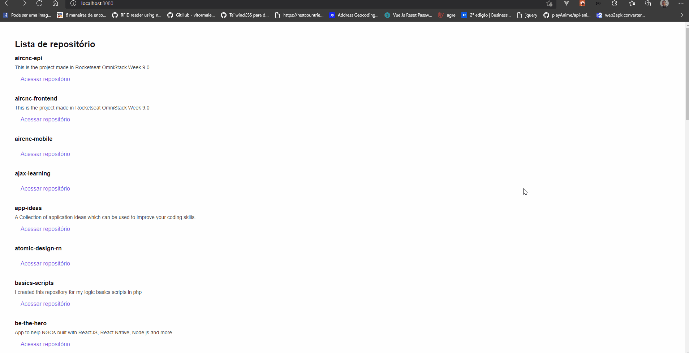

  
  
  

  A react project that lists a user's github repositories. Project creating with babel, webpack or be created with a basic structure of react assembled from scratch without even a tool like create-react-app to deepen basic concepts of react as well as understand how to optimize a react application.
  

> This project was made for learning purposes only and comes from Rocketseat's Ignite is a professional acceleration program with certified and market-recognized training.

# Development setup

> yarn is required

After cloning this repo:

### How to run

- Run `yarn` or `npm` in the `server` folder to install all dependencies
- Go back to the root folder
- Run `yarn dev` to up the project
- In browser go to url `http://localhost:8080`

# License

[MIT License](/LICENSE)
